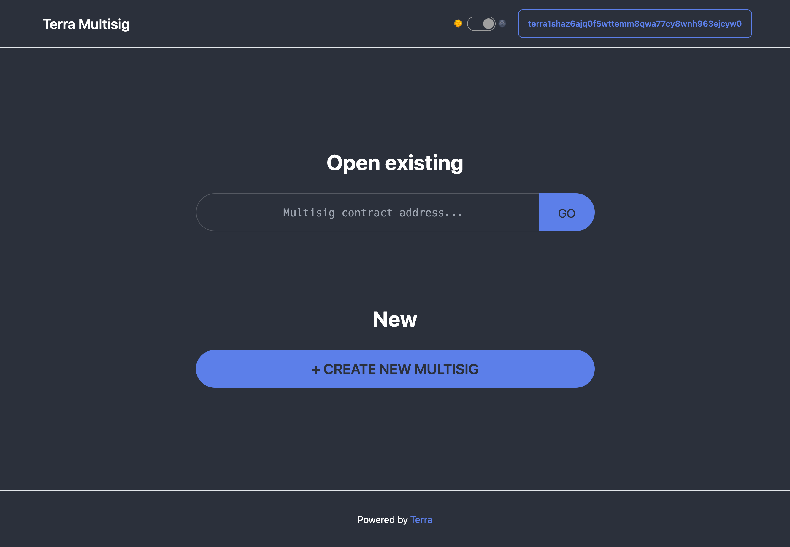

## Preview

<p align="center" width="100%">
    
</p>

## Summary

This project creates a web UI around the [CosmWasm/cw-plus](https://github.com/CosmWasm/cw-plus/) [`cw3-fixed-multisig`](https://github.com/CosmWasm/cw-plus/tree/main/contracts/cw3-fixed-multisig) smart contract. Users can:

- Create an instance of `cw3-fixed-multisig` smart contract
- View proposals for a previously instantiated multisig
- Create proposals for sending funds from the multisig
- Vote on proposals created by other users of the multisig
- Execute proposals that have reached sufficient approval vote threshold

This version of the UI is forked from https://github.com/ebaker/cw3-fixed-multisig-dapp and custimized for the [Terra](https://terra.money) blockchain.

## Proposal List UI

The proposal list UI provides icons indicating proposal status:


## Development

```bash
git clone https://github.com/octalmage/cw-fixed-multisig-dapp
```

Then, run the development server:

```bash
npm run dev
# or
yarn dev
```

Open [http://localhost:3000](http://localhost:3000) with your browser to see the result.

You can start editing the page by modifying `pages/index.tsx`. The page auto-updates as you edit the file.

## Requirements

Please ensure you have the [Keplr wallet extension](https://chrome.google.com/webstore/detail/terra-station/aiifbnbfobpmeekipheeijimdpnlpgpp?hl=en) installed in your Chrome based browser (Chrome, Brave, etc).

## Learn More

TODO

